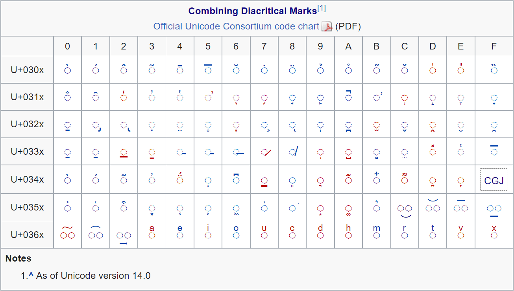
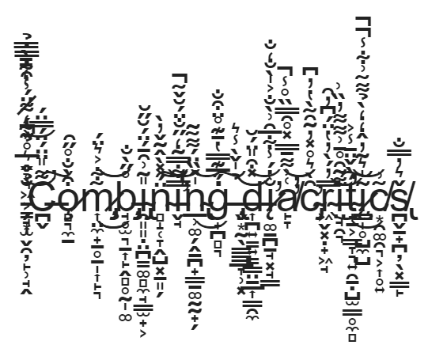

<style>
/* First slide */
#customizing-the-web { margin-top: 150px; }
.reveal div { font-size: 0.9em; }
.reveal section, .reveal .flex-column { display: flex; flex-direction: column; align-items: center; }
.reveal section img { border: 0; }
.reveal .backgrounds .slide-background[data-background-hash^="url(https"] { background-size: 80% auto !important; }
.reveal h1, .reveal p, .reveal a { text-shadow:1px 1px 2px #000, 0 0 1em #000, 0 0 0.2em #000; }
.reveal h1 { font-size: 1.8em; }
/* rest of the slides */
.reveal h2 { font-size: 1.4em;}
.reveal h3 { font-size: 1.1em; text-transform: none; }
.reveal table { font-size: 0.6em; margin-bottom: 1.5em; }
.reveal th, .reveal .purple { color: #b273df; }
.reveal span[aria-label="not supported"], .reveal .red, .reveal code strong { color: red; }
.reveal .orange { color: orange; }
.reveal a.smallest, .reveal .small-font { font-size:.5em; }
.reveal ul > li > ul { font-size:.6em; }
.reveal div > ul { display: block; }
.reveal .margin-top--2, .reveal ul + h3 { margin-top: 2em; }
.reveal .margin-top--4 { margin-top: 4em; }
.reveal .left-align { text-align: left; }
.reveal section pre.code-wrapper, .reveal section pre.code-wrapper code { white-space: pre-wrap; word-break: break-all; }
.reveal section code { color: #888; }
.reveal section img { background: transparent; border-color: #333; }
.reveal .flex-row { display: flex; justify-content: space-evenly; }
.reveal > img { display: block; }
.reveal .bottom-link { position:relative; bottom: -100px; }
.reveal .half-width { width: 50%; }
.line-through.visible { text-decoration: line-through; }
.reveal .serif { font-family: serif; font-size: 0.9em; }
.reveal .center th, .reveal .center td { text-align: center; }
</style>

# Unicode, Diacritics and Normalization

<div class="flex-column">


<a class="bottom-link smallest" href="https://dribbble.com/shots/6222338-Unicorn-Dab">
  https://dribbble.com/shots/6222338-Unicorn-Dab
</a>
</div>

---

## Quick history of encoding

* ASCII
* UCS-2
* UTF-16
* UTF-8

<div class="small-font margin-top--2">

https://www.youtube.com/watch?v=bbkUn0o3L1Y
</div>

---

## American Standard Code of Information Interchange (ASCII)

| Code Point | Denary value | Character | ASCII   |
|:----------:|-------------:|:---------:|:-------:|
| U+0045     |           69 | E         | 1000101 |
| U+03A6     |          934 | &#934;    | <span aria-label="not supported" role="img">&#10007;</span> |
| U+86CB     |        34507 | &#34507;  | <span aria-label="not supported" role="img">&#10007;</span> |
| U+1F95A    |       129370 | &#129370; | <span aria-label="not supported" role="img">&#10007;</span> |

* Initial standard of basic characters (7 bits)
* 2<sup class="small-font">7</sup> = 128 characters

---

<div class="flex-row">
  
  <div>&nbsp;</div>
  
</div>

---

## Universal Character Set (UCS-2)

| Code Point | Denary value | Character | UCS-2             |
|:----------:|-------------:|:---------:|:-----------------:|
| U+0045     |           69 | E         | 00000000 01000101 |
| U+03A6     |          934 | &#934;    | 00000011 10100110 |
| U+86CB     |        34507 | &#34507;  | 10000110 11001011 |
| U+1F95A    |       129370 | &#129370; | <span aria-label="not supported" role="img">&#10007;</span> |

* Published in 1991 (2 bytes or 16 bits)
* 2<sup class="small-font">16</sup> = 65536 characters (U+0000 to U+FFFF)
* Now called the "Basic Multilingual Plane" (BMP)

---

## Unicode Transformation Format (UTF-16)

| Code Point | Denary value | Character | UTF-16            | UTF-16 hex |
|:----------:|-------------:|:---------:|:------------------|:-----------|
| U+0045     |           69 | E         | 00000000 01000101 | 00 45 |
| U+03A6     |          934 | &#934;    | 00000011 10100110 | 03 A6 |
| U+86CB     |        34507 | &#34507;  | 10000110 11001011 | 86 CB |
| U+1F95A    |       129370 | &#129370; | <span class="red">110110</span>0000111110 <span class="orange">110111</span>0101011010 | D8 3E DD 5A |

* Published in 1996 (variable length, 16 or 32 bits)
* <span class="red">High surrogate</span> & <span class="orange">low surrogates</span> control bits introduced
* Made to be backwards compatible with UCS-2
* Byte order matters (big-endian or little-endian)
* 2<sup class="small-font">20</sup> (16 planes) + BMP (17 plane limit)

---

## Unicode Transformation Format (UTF-8)

| Code Point | Denary value | Character | UTF-8 | UTF-8 hex |
|:----------:|-------------:|:---------:|:------|:----------|
| U+0045     |           69 | E         | <span class="red">0</span>1000101 | 45 |
| U+03A6     |          934 | &#934;    | <span class="red">110</span>01110 <span class="red">10</span>100110 | CE A6 |
| U+86CB     |        34507 | &#34507;  | <span class="red">1110</span>10000 <span class="red">10</span>011011 <span class="red">10</span>001011 | E8 9B 8B |
| U+1F95A    |       129370 | &#129370; | <span class="red">11110</span>000 <span class="red">10</span>011111 <span class="red">10</span>100101 <span class="red">10</span>011010 | F0 9F A5 9A |

* Published in 1993 (variable byte length, 1 to 4 bytes)
  * <span class="red">0</span> = 1 byte
  * <span class="red">110</span> = 2 bytes
  * <span class="red">1110</span> = 3 bytes
  * <span class="red">11110</span> = 4 bytes
* Used in 98% of all web pages (2021)<sup class="small-font">[1](https://en.wikipedia.org/wiki/UTF-8)</span>
* 2<sup class="small-font">31</sup> = over 2 billion code points! (32k planes supported)

---

## Unicode

* Unicode provides a unique code for every character, in every language, in every program, on every platform.
* First published in 1991 with 7,161 characters.
* Version 14.0 (September 2021) has 144,697 characters (includes emojis! 😁)
* www.unicode.org

---

## Unicode terms

### [Codespace](https://unicode.org/glossary/#codespace):

A range of integers from <code>0</code> to <code>10FFFF</code>

### [Code Point](https://unicode.org/glossary/#code_point):

A value, or position, for a character, in any coded character set.

---

## Unicode terms

### [Plane](https://unicode.org/glossary/#plane):

- Plane is a range of 65,536 (or 10000<sub title="base 16">16</sub>) contiguous Unicode code points from <code>U+n0000</code> up to <code>U+nFFFF</code>, where <code>n</code> can take values from 0<sub title="base 16">16</sub> to 10<sub title="base 16">16</sub>.

---

## Unicode terms

### [Plane](https://unicode.org/glossary/#plane) (continued):

- The whole set of Unicode code points is split into 17 planes (1 Basic Multilingual Plane + 16 Astral planes):

| Plane | Name | Range |
|:-----:|:-----|:------|
| 0     | Basic Multilingual plane (BMP) | <code>U+0000</code>...<code>U+FFFF</code> |
| 1     | Supplementary Multilingual plane (SMP) | <code>U+<strong>1</strong>0000</code>...<code>U+<strong>1</strong>FFFF</code> |
| 2     | Supplementary Ideographic Plane | <code>U+<strong>2</strong>0000</code>...<code>U+<strong>2</strong>FFFF</code> |
| 3     | Tertiary Ideographic Plane | <code>U+<strong>3</strong>0000</code>...<code>U+<strong>3</strong>FFFF</code> |
| 4-13  | Unassigned planes | <code>U+<strong>4</strong>0000</code>...<code>U+<strong>D</strong>FFFF</code>  |
| 14    | Supplementary Special-purpose Plane | <code>U+<strong>E</strong>0000</code>...<code>U+<strong>E</strong>FFFF</code> |
| 15    | Supplementary Private Use Area A | <code>U+<strong>F</strong>0000</code>...<code>U+<strong>F</strong>FFFF</code> |
| 16    | Supplementary Private Use Area B | <code>U+<strong>10</strong>0000</code>...<code>U+<strong>10</strong>FFFF</code> |

---

## Basic Multilingual plane

<div class="flex-row">

[](https://en.wikipedia.org/wiki/Plane_%28Unicode%29)

- Includes almost all modern language characters
- **Combining diacritical marks**
- Chinese, Japanese and Korean (CJK) characters make up a large portion of this plane
- Restricted UTF-16 surrogate blocks
- Private use

</div>

---

## Diacritics

### [Combining character](https://unicode.org/glossary/#combining_character)

<div class="flex-row">

[](https://en.wikipedia.org/wiki/Combining_character)

<div class="half-width">

- Not used in isolation.
- Includes accents, diacritics, Hebrew points,
Arabic vowel signs, and Indic matras.

</div>

</div>

---

## [Zalgo text](https://en.wikipedia.org/wiki/Zalgo_text)



---

## Diacritic sizes

```js
// Dž (U+01C5; LATIN CAPITAL LETTER D WITH SMALL LETTER Z WITH CARON)
// D (U+0044; LATIN CAPITAL LETTER D)
// z (U+007A; LATIN SMALL LETTER Z)
// ž (U+017E; LATIN SMALL LETTER Z WITH CARON)
// ̌◌ (U+030C; COMBINING CARON */
const dz = ['\u01C5', 'D\u017E', 'Dz\u030C'];
console.log(dz); // => ['Dž', 'Dž', 'Dž']

dz.map(c => c.length) // => [1, 2, 3]
```

---

## Diacritic order

Order doesn't matter in most cases

```js
// ở (U+1EDF; LATIN SMALL LETTER O WITH HORN AND HOOK ABOVE)
// ̉◌ (U+0309; COMBINING HOOK ABOVE)
// ̛◌ (U+031B; COMBINING HORN)
const pho = ['ph\u1EDF', 'pho\u0309\u031B', 'pho\u031B\u0309'];
console.log(pho); // => ['phở', 'phở', 'phở']

pho.map(c => c.length) // => [3, 5, 5]
```

but these will break in right-to-left content

---

## [Normalization](https://developer.mozilla.org/en-US/docs/Web/JavaScript/Reference/Global_Objects/String/normalize)

A process of removing alternate representations of equivalent sequences from textual data, to convert the data into a form that can be binary-compared for equivalence.

- Normalization Form D (NFD)
- Normalization Form C (NFC)
- Normalization Form KD (NFKD)
- Normalization Form KC (NFKC)

---

<table class="serif center">
  <thead>
    <tr>
      <th>Source</th><th>NFD</th><th>NFC</th><th>NFKD</th><th>NFKC</th>
    </tr>
  </thead>
  <tbody>
    <tr>
      <td>&#x212b; <div class="small-font">U+212B</div></td>
      <td>&#x0041; &#x25cc;&#x030a; <div class="small-font">U+0041 U+030A</div></td>
      <td>&#x00C5; <div class="small-font">U+00C5</div></td>
      <td>&#x0041; &#x25cc;&#x030a; <div class="small-font">U+0041 U+030A</div></td>
      <td>&#x00C5; <div class="small-font">U+00C5</div></td>
    </tr>
    <tr>
      <td>&#xfb01; <div class="small-font">U+FB01</div></td>
      <td>&#xfb01; <div class="small-font">U+FB01</div></td>
      <td>&#xfb01; <div class="small-font">U+FB01</div></td>
      <td>fi <div class="small-font">U+0066 U+0069</div></td>
      <td>fi <div class="small-font">U+0066 U+0069</div></td>
    </tr>
    <tr>
      <td>&#x0032;&#x2075; <div class="small-font">U+0032 U+2075</div></td>
      <td>&#x0032;&#x2075; <div class="small-font">U+0032 U+2075</div></td>
      <td>&#x0032;&#x2075; <div class="small-font">U+0032 U+2075</div></td>
      <td>&#x0032;&#x0035; <div class="small-font">U+0032 U+0035</div></td>
      <td>&#x0032;&#x0035; <div class="small-font">U+0032 U+0035</div></td>
    </tr>
    <tr>
      <td>&#x1E69; <div class="small-font">U+1E69</div></td>
      <td>s &#x25cc;&#x0323; &#x25cc;&#x0307; <div class="small-font">U+0073 U+0323 U+0307</div></td>
      <td>&#x1E69; <div class="small-font">U+1E69</div></td>
      <td>s &#x25cc;&#x0323; &#x25cc;&#x0307; <div class="small-font">U+0073 U+0323 U+0307</div></td>
      <td>&#x1E69; <div class="small-font">U+1E69</div></td>
    </tr>
    <tr>
      <td>&#x1E9B;&#x0323; <div class="small-font">U+1E9B U+0323</div></td>
      <td>&#x017F; &#x25cc;&#x0323; &#x25cc;&#x0307; <div class="small-font">U+017F U+0323 U+0307</div></td>
      <td>&#x1E9B; &#x25cc;&#x0323; <div class="small-font">U+1E9B U+0323</div></td>
      <td>&#x0073; &#x25cc;&#x0323; &#x25cc;&#x0307; <div class="small-font">U+0073 U+0323 U+0307</div></td>
      <td>&#x1E69; <div class="small-font">U+1E69</div></td>
    </tr>
  </tbody>
</table>

<div class="small-font">

Reference: https://unicode.org/reports/tr15/#Norm_Forms
</div>

---

## Normalization Example

```js
// a (U+0061; LATIN SMALL LETTER A) + ̈◌ (U+0308; COMBINING DIAERESIS)
// =>
// ä (U+00E4; LATIN SMALL LETTER A WITH DIAERESIS)
const a = 'a\u0308'.normalize('NFC');

console.log([...a].map(c => c.charCodeAt(0).toString(16)));
// => ['e4'] 
```

---

## Why Normalize?

---

## Search databases

```js
// è (U+00E8; LATIN SMALL LETTER E WITH GRAVE)
// ́◌ (U+0301; COMBINING ACUTE ACCENT)
const str = 'Cr\u00E8me Brule\u0301e';

// normalize for modern databases
// é (U+00E9; LATIN SMALL LETTER E WITH ACUTE)
const normalized = str.normalize('NFC');
// => 'Cr\u00E8me Brule\u00E9'
```

Legacy databases

```js
// remove diacritics for legacy databases using unicode property escapes*
const anglicization = str.normalize("NFD").replace(/\p{Diacritic}/gu, '');
// => 'Creme Brulee'
```

If you need to support IE11, use

```js
const anglicization = str.normalize("NFD").replace(/[\u0300-\u036F]/g, '');
```

---

## Sorting (modern browsers)

You don't need to normalize, use [Intl.Collator](https://developer.mozilla.org/en-US/docs/Web/JavaScript/Reference/Global_Objects/Intl/Collator):

```js
const c = new Intl.Collator('fr'); // For best results, include the locale
[
  'creme brulee 2',
  'crème brulée 1',
  'creme bruleé 4',
  'cremé bruléé 3',
].sort(c.compare);
// => ['crème brulée 1', 'creme brulee 2', 'cremé bruléé 3', 'creme bruleé 4']
```

---

## Sorting (browsers older than IE11)

Use [localCompare](https://developer.mozilla.org/en-US/docs/Web/JavaScript/Reference/Global_Objects/String/localeCompare):

```js
let items = [
  'réservé',
  'Premier',
  'Cliché',
  'communiqué',
  'café',
  'Adieu',
];
items.sort(
  (a, b) => a.localeCompare(b, 'fr', { ignorePunctuation: true })
);
// => ['Adieu', 'café', 'Cliché', 'communiqué', 'Premier', 'réservé']
```

---

## [Transliteration](https://cldr.unicode.org/index/cldr-spec/unicode-transliteration-guidelines)

The general process of converting characters from one script to another, where the result is roughly phonetic for languages in the target script.

---

## Transliteration examples

### Greek (Mars moons):

- "Φόβος" becomes "Phobos"
- "Δεῖμος" becomes "Deimos"

<br />
<br />

### German personal names:

- Sharp S ("ß") becomes "ss", e.g. "Weiß" becomes "Weiss"
- Umlauts (ä, ö, ü) becomes the vowel plus "e", e.g. "Müller" becomes "Mueller"

---

## Support?

Sadly, no browsers support a transliteration. You will need to either manually perform it, or use library (e.g. https://github.com/dzcpy/transliteration)

---

## Questions?

---

## References

### Articles

- [YouTube - Unicode and Byte Order](https://www.youtube.com/watch?v=bbkUn0o3L1Y)*
- [Dmitri Pavlutin - What every JavaScript developer should know about Unicode](https://dmitripavlutin.com/what-every-javascript-developer-should-know-about-unicode/)*
- [Free Code Camp - Encoding & Unicode](https://www.freecodecamp.org/news/everything-you-need-to-know-about-encoding/)

\* Awesome!
---

## References

### Sources
- [Glossary of Unicode Terms](https://unicode.org/glossary)
- [Wikipedia - Plane (Unicode)](https://en.wikipedia.org/wiki/Plane_%28Unicode%29)
- [Wikipedia - Combining characters](https://en.wikipedia.org/wiki/Combining_character)
- [MDN - String normalize](https://developer.mozilla.org/en-US/docs/Web/JavaScript/Reference/Global_Objects/String/normalize)
- [MDN - Unicode property escapes](https://developer.mozilla.org/en-US/docs/Web/JavaScript/Guide/Regular_Expressions/Unicode_Property_Escapes)
- [Stack Overflow - Remove accents/diacritics in a string in JavaScript](https://stackoverflow.com/a/37511463/145346)
- [CLDR Transliteration guidelines](https://cldr.unicode.org/index/cldr-spec/unicode-transliteration-guidelines)
- [Zalgo text](https://en.wikipedia.org/wiki/Zalgo_text)


---

## Thanks!

### Rob Garrison


&#x00ab;w&#x006f;wm&#111;&#x0074;&#116;y&#x40;&#103;m&#x0061;il&#46;c&#111;m&#187;
<br>
[github.com/Mottie](https://github.com/Mottie)
